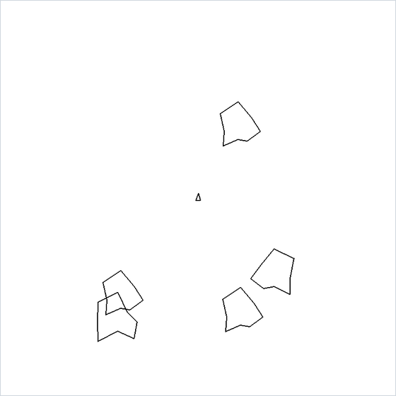

<div align="center">

# Asteroids

*A vector-style arcade shooter where every ship and rock is a polygon stored in polar coordinates.*




</div>

## About

A small take on the 1979 arcade classic, written from scratch in a single Pygame file. The ship drifts with inertia, the screen wraps around at every edge, and each large asteroid breaks into three smaller ones when hit. There are no sprites or images: the ship and every rock are lists of polar points that the game converts to screen coordinates every frame, and missiles are small dots.

## Quick start

```bash
python -m pip install -r requirements.txt
python asteroids.py
```

## Controls

| Input | Action |
| --- | --- |
| <kbd>W</kbd> / <kbd>S</kbd> | Thrust forward / backward |
| <kbd>A</kbd> / <kbd>D</kbd> | Rotate left / right |
| <kbd>Space</kbd> | Fire |
| Close the window | Quit |

## How it works

- **Shapes in polar form.** A sprite is a list of `[angle, radius]` vertices. Rotating means adding to every angle. Drawing converts each vertex around the sprite's centre $(x_0, y_0)$:

  ```math
  (x,\,y) = \bigl(x_0 + r\sin\theta,\; y_0 + r\cos\theta\bigr)
  ```

- **Motion.** Each object integrates its own velocity with the real time elapsed since its last update, so speed does not depend on the frame rate. Thrust accelerates the ship at 300 px/s² along its heading, and its speed is clamped at 300 px/s.

  ```math
  \mathbf v \leftarrow \mathbf v + \mathbf a\,\Delta t,\qquad \mathbf p \leftarrow \mathbf p + \mathbf v\,\Delta t
  ```

- **Wrap-around.** A position that leaves the 800 × 800 window re-enters from the opposite edge, so the playfield is a torus.
- **Missiles** inherit the ship's velocity plus 300 px/s in the firing direction and expire after 2 seconds.
- **Collisions** are distance checks against a circle of radius 20 px per asteroid size. A hit on a size-3 or size-2 rock replaces it with three rocks one size smaller. Size-1 rocks are destroyed.
- **Lives.** The ship has three. A collision costs one and respawns the ship at the centre at rest.

## Limitations

- There is no score, lives display or game-over screen. When the last life is lost the ship disappears and the rocks keep drifting. <kbd>Space</kbd> still fires missiles upward from the centre of the screen, where the ship was last reset.
- Clearing the field does not start a new wave.
- Respawning has no invulnerability window, so landing on a rock can cost several lives in consecutive frames.
- The main loop is uncapped (no `Clock.tick`), so it keeps one CPU core busy.
- `corazonRojo.png`, a red heart meant for a lives indicator, is not used yet.

---

<div align="center"><sub>Part of <a href="https://github.com/lnivan">lnivan's projects</a> · <b>Games</b></sub></div>
