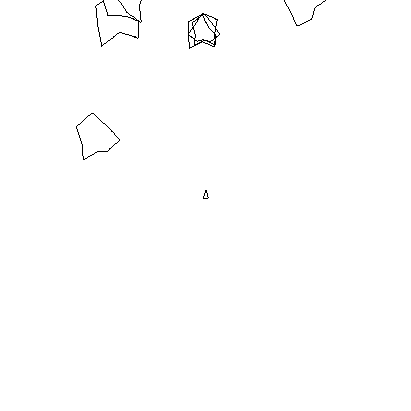

# Asteroids

A vector-style Asteroids game built with Python and Pygame.



## What it contains

- A rotating spaceship with forward and reverse thrust.
- Missiles, moving asteroids and collision handling.

## Setup

Use Python 3.12. From the repository folder:

```bash
python -m venv .venv
# Windows PowerShell: .venv\Scripts\Activate.ps1
# macOS / Linux: source .venv/bin/activate
python -m pip install -r requirements.txt
python asteroids.py
```

## Controls

A / D rotate; W / S apply forward / reverse thrust; Space fires.

## Project status

An early arcade project with a minimal interface.

## Project collection

Part of [lnivan's projects](https://github.com/lnivan), under **Games**.
